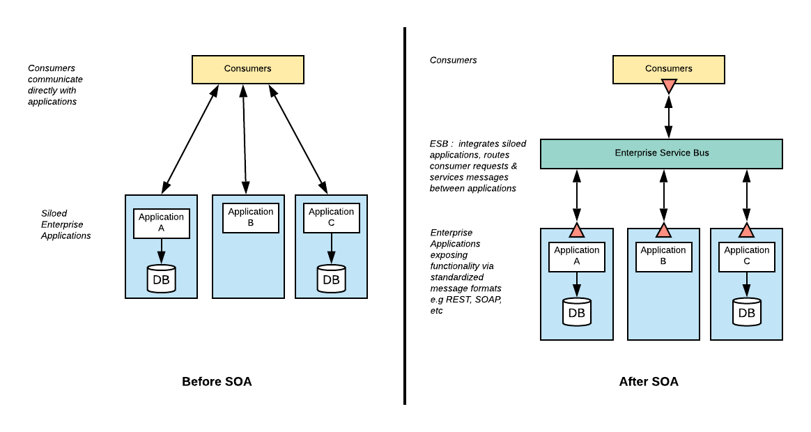
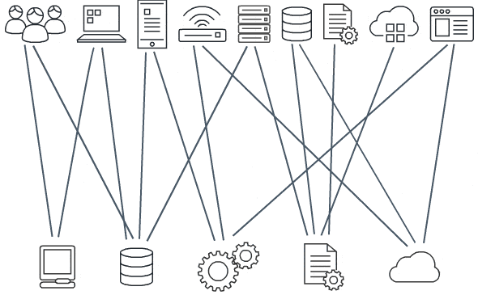

<h1 align="center"> Service-Oriented Architecture Project </h1>

# Content

1. [Project Status](#projectstatus)
2. [About the Project](#abouttheproject)
3. [Project Description](#projectdescription)
4. [Chapter 1: Introduction](#chapter1)
    - [Chapter 1 - Part 1: What is SOA?](#chapter1part1)
    - [Chapter 1 - Part 2: What is an ESB?](#chapter1part2)
    - [Chapter 1 - Part 3: What is WSO2 EI?](#chapter1part3)
    - [Chapter 1 - Part 4: WSO2 ESB by Example](#chapter1part4)
    - [Chapter 1 - Part 5: Enterprise Integration Patterns](#chapter1part5)
    - [Chapter 1 - Part 6: Useful links](#chapter1part6)
5. [Chapter 2: Basic WSO2 EI 6.1.1 Tutorial](#chapter2)
    - [Chapter 2 - Part 1: Configuring WSO2 EI 6.1.1 on Windows 10 64 Bit](#chapter2part1)
    - [Chapter 2 - Part 2: Integration Example](#chapter2part2)
6. [Usage](#usage)
7. [Contributors](#contributors)
8. [Contributing](#contributing)
9. [Roadmap](#roadmap)
10. [To Do](#todo)
11. [Contacts](#contacts)
12. [License](#license)

# Project Status <a name="projectstatus"></a>

Project Status: Concluded :heavy_check_mark:

# About the Project <a name="abouttheproject"></a>

This project 

[![Project][project-shield]][project-url]

# Project Description <a name="projectdescription"></a>

Este projeto tem como objetivo, criar tutoriais do ESB WSO2 para consulta.

## <a name="chapter1"></a>Chapter 1: Introduction

#### <a name="chapter1part1"></a>Chapter 1 - Part 1: What is SOA?

SOA, or service-oriented architecture, defines a way to make software components reusable and interoperable via service interfaces. Services use common interface standards and an architectural pattern so they can be rapidly incorporated into new applications.  This removes tasks from the application developer who previously redeveloped or duplicated existing functionality or had to know how to connect or provide interoperability with existing functions.

Each service in an SOA embodies the code and data required to execute a complete, discrete business function (e.g. checking a customer’s credit, calculating a monthly loan payment, or processing a mortgage application). The service interfaces provide loose coupling, meaning they can be called with little or no knowledge of how the service is implemented underneath, reducing the dependencies between applications. 

This interface is a service contract between the service provider and service consumer. Applications behind the service interface can be written in Java, Microsoft .Net, Cobol or any other programming language, supplied as packaged software applications by a vendor (e.g., SAP), SaaS applications (e.g., Salesforce CRM), or obtained as open source applications.  Service interfaces are frequently defined using Web Service Definition Language (WSDL) which is a standard tag structure based on xml (extensible markup language).  

The services are exposed using standard network protocols—such as SOAP (simple object access protocol)/HTTP or Restful HTTP (JSON/HTTP)—to send requests to read or change data. Service governance controls the lifecycle for development and at the appropriate stage the services are published in a registry that enables developers to quickly find them and reuse them to assemble new applications or business processes.

These services can be built from scratch but are often created by exposing functions from legacy systems of record as service interfaces.

In this way, SOA represents an important stage in the evolution of application development and integration over the last few decades. Before SOA emerged in the late 1990s, connecting an application to data or functionality housed in another system required complex point-to-point integration—integration that developers had to recreate, in part or whole, for each new development project. Exposing those functions through SOA services allowed the developer to simply reuse the existing capability and connect through the SOA ESB architecture.

<br>

<div align="center"><br><sub>Fig 1 - Monolith Architecture vs SOA Architecture  - (<a href='https://mualle.net/microservices-architecture-vs-service-oriented-architecture/'>Work by Mualle Mats'ela </a>) </sub></div>

<br>

[Source][ibmsoa-url]

#### <a name="chapter1part2"></a>Chapter 1 - Part 2: What is an ESB?

An ESB, or enterprise service bus, is an architectural pattern whereby a centralized software component performs integrations between applications.  It performs transformations of data models, handles connectivity/messaging, performs routing, converts communication protocols and potentially manages the composition of multiple requests. The ESB can make these integrations and transformations available as a service interface for reuse by new applications. The ESB pattern is typically implemented using a specially designed integration runtime and toolset that ensures the best possible productivity.

It is possible to implement an SOA without an ESB, but this would be equivalent to just having a bunch of services.  Each application owner would need to directly connect to any service it needs and perform the necessary data transformations to meet each of the service interfaces. This is a lot of work (even if the interfaces are reusable) and creates a significant maintenance challenges in the future as each connection is point to point.  In fact, ESBs were, eventually, considered such a de facto element of any SOA implementation that the two terms are sometimes used as synonyms, creating confusion.

<br>

<div align="center"><br><sub>Fig 2 - ESB  - (<a href='https://wso2.com/integration/'>Work by WSO2 </a>) </sub></div>

<br>

[Source][ibmsoa-url]

#### <a name="chapter1part3"></a>Chapter 1 - Part 3: What is WSO2 EI?

WSO2 Enterprise Integrator (WSO2 EI) is an open-source hybrid integration platform providing graphical and CLI tooling, integration runtimes, and monitoring with a variety of deployment options. The integration runtime engine is capable of playing multiple roles in your enterprise architecture. It can act as an ESB, a streaming data processor, and a microservices integrator. Deployment options include on-premises, cloud, hybrid, or a container orchestration platform of choice.


#### <a name="chapter1part4"></a>Chapter 1 - Part 4: WSO2 ESB by Example

<br>

<div align="center"><br><sub>Fig 1 - Exemplo de Short-Running Integration Flows - (<a href='https://docs.wso2.com/display/EI611/Introducing+the+Enterprise+Integrator'>Work by WSO2</a>) </sub></div>

<br>

Flow example of how an application's request with its [endpoint][endpoint-url] propagates through the ESB (Enterprise Service Bus) profile. Response would be the inverse of this flow.

1. An application (client) sends a message to the ESB profile of the WSO2 EI.
2. The message is picked up by a [transport][transporte-url].
3. The transport sends the message through a message pipe, which handles quality of service aspects such as security. Internally, this pipe is the input and output stream of the Axis2 engine. The ESB profile can operate in two modes:
	- [Mediating Message][mediatingmessage-url] - A single pipe is used
	- [Proxy Services][proxyservice-url] - Separate pipes connecting the transport to different proxy services.
4. Message transformation and routing can be considered as a single unit. As the diagram specifies, there is no clear separation between the message transformation components and the routing components. In the ESB profile of the WSO2 EI, this is known as the mediation framework. Some transformations occur before the routing decision is made, while others occur after the routing decision. This is part of the Synapse implementation.
5. The message is injected over separate pipes depending on the destinations. Here again, the quality of service aspects of the messages are determined.
6. The transport layer takes care of transport protocol transformations that are required before sending the message to the client application.

Message is sent to client application

There are other areas, like [Working with Scheduled Tasks][scheduletask-url] and [Events][events-url], which are not shown in the diagram. All these components can be analyzed and monitored and perform message tracking using the profile [EI-Analytics][eianalytics-url].

#### <a name="chapter1part5"></a>Chapter 1 - Part 5: Enterprise Integration Patterns

- Over the years, architects have invented a combination of integration patterns to connect various business applications within enterprise systems. Most of these architectures have similarities, starting a set of widely accepted patterns in integration patterns. These standards are described in the Enterprise Integration Standards Catalog available [her][eai-url].

- You can simulate most of the patterns in the catalog using various builds of the WSO2 EI ESB profile. For ideas on how to design your integrations and step-by-step instructions using example scenarios, see [Enterprise Integration Standards with WSO2 Enterprise Integrator.][eaiwso2-url] You can then refer to this guide for details about the mediators used in the scenarios, how to work with endpoints and proxy services, and so on.

#### <a name="chapter1part9"></a>Chapter 1 - Part 6: Useful links

- [WSO2 Certified Enterprise Integrator 6 Developer][certifiedwso2ei6-url]

- [WSO2 Certified API Manager Developer - V3][certifiedwso2apimanagerv3-url]

- [Enterprise Integration Patterns][eai2-url]

- [O que é WSO2 ESB?][whatsiswso2esb-url]

- [Um pouco sobre o WSO2][blog1wso2-url]

- [O que é arquitetura orientada a serviços (SOA)?][blog2wso2-url]

- [Conceitos sobre Enterprise Service Bus (ESB)][esbkeyconcepts-url]

- [Documentação WSO2 Enterprise Integrator 6.1.1][docwso2ei611-url]

- [Conectores Disponiveis no WSO2][conectors-url]

- Messaging Models:
	- [Point-to-Point][pointpoint-url]
	- [Publish/Subscriber][publish-url]
	- [Tipos JMS][jms-url]
	- [Transações distribuídas e JMS Transactions][distributed-url]

- [Códigos de estado HTTP][http-url]

- [Instalando o cURL][installcurl-url]

- [Usando o cURL para requisições HTTP][curl-url]

- [SOAP vs REST][soaprest-url]

- [XML SOAP][xmlsoap-url]

- [XML Schemas][xmlschema-url]

- WSDL
 	- [Link 1][wsdl-url]
 	- [Link 2][wsdl2-url]

## <a name="chapter2"></a>Chapter 2: Basic WSO2 EI 6.1.1 Tutorial

#### <a name="chapter2part1"></a>Chapter 2 - Part 1: Configuring WSO2 EI 6.1.1 on Windows 10 64 Bit

- Java JDK 8 Installation
	- Download and install Java JDK 8 from Zulu (`zulu8.54.0.21-ca-jdk8.0.292-win_x64`) -> [Link][zulujava-url]
	- Create a folder named `Java` in `C:\Program Files`
	- Extract the downloaded content to `C:\Program Files\Java`
	- Go to edit system variables
	- Create the `JAVA_HOME` variable with the value `C:\Program Files\Java\jdk-8.0.292\`
	- Go to the `Path` variable and add the path `C:\Program Files\Java\jdk-8.0.292\bin`

- Installation of WSO2 EI 6.1.1
	- Select Enterprise Integrator 6.1.1 version -> [Link][wso2eidown-url]
	- Download Binary
	- Create a `Work` folder in `C:\`
	- Extract the content downloaded to `C:\Work`
	- The directory `C:\Work\wso2ei-6.1.1` will be called (`WSO2_ESB_HOME`)

- Running Broker, Analytics and ESB
	- **Broker**
		- Run the Broker: `C:\Work\wso2ei-6.1.1\wso2\broker\bin\wso2server.bat`
		- When appearing `https://localhost:9446/carbon/` on the Broker console, put this address in the browser.
		- Login with login and password `admin`, `admin`.

	- **Analytics**
		- Run the Analytics: `C:\Work\wso2ei-6.1.1\wso2\analytics\bin\wso2server.bat`
		- When appearing `https://localhost:9444/carbon/` on the Analytics console, put this address in the browser
		- Login with login and password `admin`, `admin`.

	- **Integrator**
		- Run the Integrator: `C:\Work\wso2ei-6.1.1\bin\integrator.bat`
		- When appearing `https://localhost:9443/carbon/` on the Integrator console, put this address in the browser.
		- Login with login and password `admin`, `admin`.

- Installing the Eclipse IDE
	- Select Enterprise Integrator 6.1.1 version -> [Link][wso2eidown-url]
	- Download Tooling from Windows 64-bits link
	- Create a Workspace folder in `C:\Work`
	- Extract Eclipse and run the `C:\eclipse\eclipse.exe`
	- When starting the IDE, register the location as workspace `C:\Work\Workspace`

- Configuring Access to Integrator by Password (Configuring Vault for the Future)
	- Go to `C:\Work\wso2ei-6.1.1\conf\security`
	- Open `secret-conf` file with text editor
	- Delete the content, add the following content below and save:

```
#Thu Nov 16 16:56:15 WET 2017
keystore.identity.location=repository/resources/security/wso2carbon.jks
keystore.identity.type=JKS
keystore.identity.store.password=identity.store.password
keystore.identity.store.secretProvider=org.wso2.carbon.securevault.DefaultSecretCallbackHandler
secretRepositories.file.provider=org.wso2.securevault.secret.repository.FileBaseSecretRepositoryProvider
secretRepositories.file.location=conf/security/cipher-text.properties
secretRepositories=file
keystore.identity.key.password=identity.key.password
carbon.secretProvider=org.wso2.securevault.secret.handler.SecretManagerSecretCallbackHandler
keystore.identity.key.secretProvider=org.wso2.carbon.securevault.DefaultSecretCallbackHandler
keystore.identity.alias=wso2carbon
```

#### <a name="chapter2part2"></a>Chapter 2 - Part 2: Integration Example


# Usage <a name="usage"></a>

Uso pessoal para consulta de rotina laboral

# Contributors <a name="contributors"></a>

| [ <br> <sub> Vitor Garcia </sub>][github-url] | 
| :-----------------------------------------------------------------------------------------------------: |

# Contributing <a name="contributing"></a>

Contributions are what make the open source community such an amazing place to be learn, inspire, and create. Any contributions you make are **greatly appreciated**.

1. Fork the Project
2. Create your Feature Branch (`git checkout -b feature/AmazingFeature`)
3. Commit your Changes (`git commit -m 'Add some AmazingFeature'`)
4. Push to the Branch (`git push origin feature/AmazingFeature`)
5. Open a Pull Request

# Roadmap <a name="roadmap"></a>

See the [![Issues][issues-shield]][issues-url]  for a list of proposed features (and known issues).

# To Do <a name="todo"></a>

Usage for project in SOA overview.

# Contacts <a name="contacts"></a>

| Vitor Garcia                                     |
| :----------------------------------------------- |
| [![LinkedIn][linkedin-shield]][linkedin-url]     |
| [![Portfolio][portfolio-shield]][portfolio-url]  |
| [![GitHub][github-shield]][github-url]           |

# License <a name="License"></a>

- [![MIT License][license-shield]][license-url]

- Distributed under the MIT License. See `LICENSE` for more information.


<!-- README TUTORIALS -->

<!--

https://dev.to/reginadiana/como-escrever-um-readme-md-sensacional-no-github-4509

-->

<!-- 

Mark Down Guide - Readme Text Format Style

https://www.markdownguide.org/

-->

<!-- 

How to Create your Badges

https://gist.github.com/rupeshtiwari/8558ca0d8ec1c15619e4492dcd6aa81a

-->

<!-- USEFUL LINKS -->

<!--

Free Images Without Copyright

https://unsplash.com/


-->

<!-- MY BADGES -->

[project-shield]: https://img.shields.io/badge/link-project-green.svg
[project-url]: https://github.com/vitorstabile/work/tree/main/AMA
[linkedin-shield]: https://img.shields.io/badge/my-linkedin-blue.svg 
[linkedin-url]: https://www.linkedin.com/in/vitor-garcia-5b151b67/
[portfolio-shield]: https://img.shields.io/badge/my-portfolio-red.svg
[portfolio-url]: https://vitorstabile.github.io
[github-shield]: https://img.shields.io/badge/my-github-green.svg
[github-url]: https://github.com/vitorstabile
[issues-shield]: https://img.shields.io/badge/link-issues-green.svg
[issues-url]: https://github.com/vitorstabile/service-oriented-architecture/issues
[license-shield]: https://img.shields.io/badge/license-mit-blue.svg 
[license-url]: https://github.com/vitorstabile/service-oriented-architecture/blob/main/LICENSE.txt
[ibmsoa-url]: https://www.ibm.com/cloud/learn/soa
[wso2apimanager-url]: https://wso2.com/api-manager/
[wso2ei-url]: https://wso2.com/integration/
[wso2identity-url]: https://wso2.com/identity-and-access-management/
[endpoint-url]: https://docs.wso2.com/display/EI611/Working+with+Endpoints
[transporte-url]: https://docs.wso2.com/display/EI611/ESB+Transports
[eai-url]: https://www.enterpriseintegrationpatterns.com/patterns/messaging/toc.html
[eaiwso2-url]: https://docs.wso2.com/display/EIP/Enterprise+Integration+Patterns+with+WSO2+Enterprise+Integrator
[mediatingmessage-url]: https://docs.wso2.com/display/EI611/Mediating+Messages
[proxyservice-url]: https://docs.wso2.com/display/EI611/Working+with+Proxy+Services
[scheduletask-url]: https://docs.wso2.com/display/EI611/Working+with+Scheduled+Tasks
[events-url]: https://docs.wso2.com/display/EI611/Working+with+Topics+and+Events
[eianalytics-url]: https://docs.wso2.com/display/EI611/Enterprise+Service+Bus+Analytics
[certifiedwso2ei6-url]: https://wso2.com/training/certification/certified-enterprise-integrator6-developer
[certifiedwso2apimanagerv3-url]: https://wso2.com/training/certification/certified-api-manager-developer
[eai2-url]: https://www.enterpriseintegrationpatterns.com/patterns/messaging/
[whatsiswso2esb-url]: https://wso2.com/library/articles/2017/07/what-is-wso2-esb/
[esbkeyconcepts-url]: https://docs.wso2.com/display/EI650/Key+Concepts#KeyConcepts-EnterpriseServiceBus(ESB)concepts
[docwso2ei611-url]: https://docs.wso2.com/display/EI611/WSO2+Enterprise+Integrator+Documentation
[conectors-url]: https://docs.wso2.com/display/ESBCONNECTORS/WSO2+ESB+Connectors+Documentation
[pointpoint-url]: https://docs.wso2.com/display/EI660/Point-to-Point+Messaging
[publish-url]: https://docs.wso2.com/display/EI660/Pub-Sub+Messaging+using+Topics
[jms-url]: https://docs.wso2.com/display/EI660/JMS+Usecases+
[distributed-url]: https://docs.wso2.com/display/EI660/Working+with+Transactions+
[http-url]: https://pt.wikipedia.org/wiki/Lista_de_c%C3%B3digos_de_estado_HTTP#Lista_de_c%C3%B3digos_de_status_HTTP
[soaprest-url]: https://pt.stackoverflow.com/questions/11183/quais-as-principais-diferen%c3%a7as-entre-soap-rest
[xmlsoap-url]: https://www.w3schools.com/xml/xml_soap.asp
[xmlschema-url]: https://www.dicas-l.com.br/arquivo/tutorial_xml-schema.php
[wsdl-url]: https://pt.stackoverflow.com/questions/29116/o-que-%C3%A9-wsdl-web-services-description-language
[wsdl2-url]: https://www.devmedia.com.br/wsdl-simplifique-a-integracao-de-dados-via-web-service/30066
[zulujava-url]: https://www.azul.com/downloads/?package=jdk
[wso2eidown-url]: https://wso2.com/integration/previous-releases/
[workproxy-url]: https://docs.wso2.com/display/EI611/Working+with+Proxy+Services
[mediators-url]: https://docs.wso2.com/display/EI611/Mediators
[logs-url]: https://docs.wso2.com/display/EI611/Log+Mediator
[respond-url]: https://docs.wso2.com/display/EI611/Respond+Mediator
[property-url]: https://docs.wso2.com/display/EI611/Property+Mediator
[installcurl-url]: https://curl.haxx.se/dlwiz/
[curl-url]: https://adityasridhar.com/posts/how-to-easily-use-curl-for-http-requests
[blog1wso2-url]: https://gago.io/blog/wso2-open-source-soa-suite/
[blog2wso2-url]: https://www.redhat.com/pt-br/topics/cloud-native-apps/what-is-service-oriented-architecture
