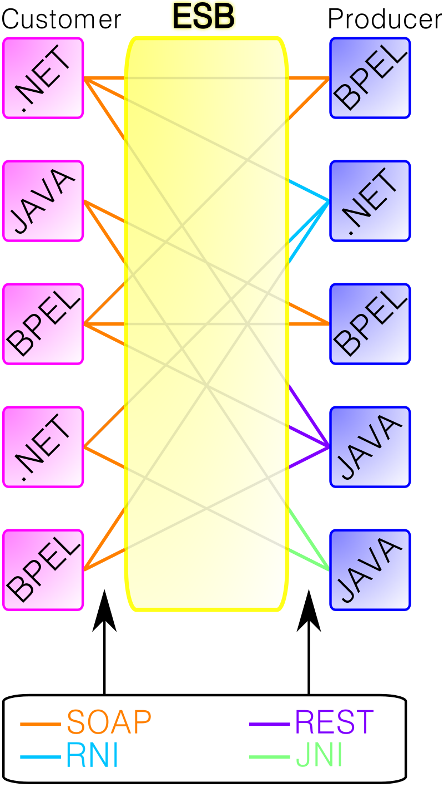

<h1 align="center"> Service-Oriented Architecture Project </h1>

# Content

1. [Project Status](#projectstatus)
2. [About the Project](#abouttheproject)
3. [Project Description](#projectdescription)
4. [Chapter 1: Introduction](#chapter1)
    - [Chapter 1 - Part 1: O que é o WSO2?](#chapter1part1)
    - [Chapter 1 - Part 2: Quais produtos principais o WSO2 oferece?](#chapter1part2)
    - [Chapter 1 - Part 3: O que é o WSO2 Enterprise Integrator 6.1.1 (WSO2 EI)?](#chapter1part3)
    - [Chapter 1 - Part 4: ESB Profile](#chapter1part4)
    - [Chapter 1 - Part 5: Business Process Profile](#chapter1part5)
    - [Chapter 1 - Part 6: Enterprise Integration Patterns](#chapter1part6)
    - [Chapter 1 - Part 7: O que é um ESB?](#chapter1part7)
    - [Chapter 1 - Part 8: Certificações da Plataforma WSO2](#chapter1part8)
    - [Chapter 1 - Part 9: Links Úteis](#chapter1part9)
5. [Chapter 2: Basic WSO2 EI 6.1.1 Tutorial](#chapter2)
    - [Chapter 2 - Part 1: Configurando o WSO2 EI no Windows 10 64 Bits](#chapter2part1)
    - [Chapter 2 - Part 2: Configurando o WSO2 EI no Linux](#chapter2part2)
    - [Chapter 2 - Part 3: Working with Proxy Services](#chapter2part3)
    - [Chapter 2 - Part 4: Extracting Message Content](#chapter2part4)
6. [Usage](#usage)
7. [Contributors](#contributors)
8. [Contributing](#contributing)
9. [Roadmap](#roadmap)
10. [To Do](#todo)
11. [Contacts](#contacts)
12. [License](#license)

# Project Status <a name="projectstatus"></a>

Project Status: Concluded :heavy_check_mark:

# About the Project <a name="abouttheproject"></a>

This project 

[![Project][project-shield]][project-url]

# Project Description <a name="projectdescription"></a>

Este projeto tem como objetivo, criar tutoriais do ESB WSO2 para consulta.

## <a name="chapter1"></a>Chapter 1: Introdução

#### <a name="chapter1part1"></a>Chapter 1 - Part 1: O que é o WSO2?

É uma plataforma de integração de API´s, aplicações e outras webservices locais ou pela internet.

#### <a name="chapter1part2"></a>Chapter 1 - Part 2: Quais produtos principais o WSO2 oferece?

- [WSO2 API Manager][wso2apimanager-url]: Plataforma completa para construir, integrar e expor seus serviços digitais como APIs gerenciadas na nuvem, no local e arquiteturas híbridas para conduzir sua estratégia de transformação digital. Ele permite que os desenvolvedores de API projetem, publiquem e gerenciem o ciclo de vida de APIs e gerentes de produto de API para criar produtos de API a partir de uma ou mais APIs.

- [WSO2 Enterprise Integrator][wso2ei-url]: O WSO2 Enterprise Integrator (WSO2 EI) é uma plataforma de integração híbrida de código aberto que permite a integração centrada em API usando estilos de arquitetura de integração, como microsserviços ou ESB centralizado. A plataforma fornece um designer gráfico de fluxo de arrastar e soltar e uma abordagem orientada à configuração para construir soluções de integração de baixo código para projetos nativos de contêiner e nuvem.

- [WSO2 Identity Server][wso2identity-url]: O WSO2 Identity Server é um produto IAM de código aberto orientado por API projetado para ajudá-lo a construir soluções CIAM eficazes. Ele é baseado em padrões abertos, como SAML, OAuth e OIDC, com as opções de implantação de local, nuvem e híbrido. Ele oferece suporte a requisitos complexos de IAM devido à sua alta extensibilidade.

#### <a name="chapter1part3"></a>Chapter 1 - Part 3: O que é o WSO2 Enterprise Integrator 6.1.1 (WSO2 EI)?

- O WSO2 Enterprise Integrator (WSO2 EI) é uma solução de integração abrangente que permite a comunicação entre vários aplicativos distintos. Em vez de fazer com que seus aplicativos se comuniquem diretamente entre si em todos os seus vários formatos, cada aplicativo simplesmente se comunica com o WSO2 EI, que atua principalmente como um ESB para lidar com a transformação e o roteamento das mensagens para seus destinos apropriados. O produto WSO2 EI pode ser usado para gerenciar fluxos de integração de curta duração **(Short-running integration flows)** e sem estado (usando o perfil ESB), bem como processos de negócios de longa duração **(Long-running business processes)** e com estado (usando o perfil de Processo de Negócios). O produto também inclui um perfil Analytics separado para monitoramento abrangente, um perfil do Message Broker (WSO2 MB) que pode ser usado para mensagens confiáveis, bem como o perfil WSO2 MSF4j, que pode ser usado para executar microsserviços para seus fluxos de integração.

- Portanto, WSO2 EI é essencialmente uma coleção de padrões de design de arquitetura corporativa (WSO2 ESB ++) que podem ser implementados diretamente usando um único produto. Este produto é leve e versátil. É 100% open source e é lançado sob a Apache Software License Version 2.0, uma das licenças mais amigáveis para negócios disponíveis atualmente.

<br>

<div align="center"><br><sub>Fig 1 - Exemplo de Short-Running Integration Flows - (<a href='https://docs.wso2.com/display/EI611/Introducing+the+Enterprise+Integrator'>Work by WSO2</a>) </sub></div>

<br>

Exemplo de fluxo de como uma request de uma aplicação com seu [endpoint][endpoint-url] se propaga através do perfil ESB (Enterprise Service Bus). A Response seria o inverso desse fluxo.

1. Um aplicativo (cliente) envia uma mensagem ao perfil ESB do WSO2 EI.
2. A mensagem é captada por um [transporte][transporte-url].
3. O transporte envia a mensagem por meio de um message pipe, que lida com aspectos de qualidade de serviço, como segurança. Internamente, esse pipe é o fluxo de entrada e saída do motor Axis2. O perfil ESB pode operar em dois modos:
	- [Mediating Message][mediatingmessage-url] - Um único pipe é usado
	- [Proxy Services][proxyservice-url] - Pipes separados conectando o transporte a diferentes serviços de proxy.
4. A transformação e o roteamento da mensagem podem ser considerados como uma única unidade. Conforme especifica o diagrama, não há separação clara entre os componentes de transformação da mensagem e os componentes de roteamento. No perfil ESB do WSO2 EI, isso é conhecido como estrutura de mediação. Algumas transformações ocorrem antes que a decisão de roteamento seja feita, enquanto outras ocorrem após a decisão de roteamento. Isso faz parte da implementação do Synapse.
5. A mensagem é injetada em pipes separados, dependendo dos destinos. Aqui, novamente, os aspectos de qualidade de serviço das mensagens são determinados.
6. A camada de transporte cuida das transformações do protocolo de transporte que são necessárias antes de enviar a mensagem ao aplicativo do cliente.

A Mensagem é enviada ao aplicativo do cliente

Existem outras áreas, como [Working with Scheduled Tasks][scheduletask-url] e [Events][events-url], que não são mostradas no diagrama. Todos esses componentes podem ser analisados e monitorados e realizar o rastreamento de mensagens usando o perfil [EI-Analytics][eianalytics-url].

#### <a name="chapter1part4"></a>Chapter 1 - Part 4: ESB Profile

- O perfil ESB no WSO2 EI **(ESB Profile)** fornece seus serviços fundamentais por meio de um mecanismo de mensagens orientado a eventos e baseado em padrões (o barramento), que permite que os arquitetos de integração explorem o valor das mensagens sem escrever código. Este perfil ESB está um passo à frente das versões anteriores do WSO2 Enterprise Service Bus, pois fornece recursos de integração de dados no mesmo tempo de execução. Isso elimina a necessidade de usar um servidor de serviços de dados separado para seus processos de integração.

#### <a name="chapter1part5"></a>Chapter 1 - Part 5: Business Process Profile

- O perfil de processo de negócios no WSO2 EI **(Business Process Profile)** permite que os desenvolvedores implantem facilmente processos de integração de longa duração (processos de negócios). Esses processos são escritos usando o seguinte: Um subconjunto do padrão BPMN 2.0, padrões WS-BPEL 2.0 e BPEL4People e WS-Human Tasks. Equipado com o motor BPEL Activiti BPMN Engine 5.21.0 e Apache Orchestration Director Engine (ODE), o perfil de processo de negócios no WSO2 EI vem com um console de gerenciamento gráfico completo baseado na web, permitindo aos usuários facilmente implantar, gerenciar, visualizar e executar processos bem como tarefas humanas.

#### <a name="chapter1part6"></a>Chapter 1 - Part 6: Enterprise Integration Patterns

- Ao longo dos anos, os arquitetos inventaram uma combinação de padrões de integração para conectar vários aplicativos de negócios dentro de sistemas corporativos. A maioria dessas arquiteturas tem semelhanças, iniciando um conjunto de padrões amplamente aceitos em padrões de integração. Esses padrões são descritos no Catálogo de Padrões de Integração Corporativa disponível [aqui][eai-url].

- Você pode simular a maioria dos padrões no catálogo usando várias construções do perfil ESB do WSO2 EI. Para obter ideias sobre como projetar suas integrações e obter instruções passo a passo usando cenários de exemplo, consulte [Padrões de integração corporativa com WSO2 Enterprise Integrator.][eaiwso2-url] Você pode então consultar este guia para obter detalhes sobre os mediadores usados nos cenários, como trabalhar com pontos de extremidade e serviços de proxy e assim por diante.

#### <a name="chapter1part7"></a>Chapter 1 - Part 7: O que é um ESB?

- O Enterprise Service Bus (ESB) se refere à arquitetura de construção de software tipicamente implementado em tecnologias encontradas na categoria de produtos de infra-estrutura de middleware. Normalmente baseado no reconhecimento de padrões, que fornecem uma base de serviços para arquiteturas mais complexas via um driver de evento e padrões baseados em mensagens (BUS). Um ESB geralmente fornece uma abstração de camadas na implementação de um sistema empresarial de mensagens, que permita integração da arquitetura para explorar o valor das mensagens sem escrever código. Contrariando a clássica integração de aplicações comerciais (EAI). A base de um enterprise service bus é construída da quebra de funções básicas em partes, que são distribuídas onde for preciso. ESB não implementa uma arquitetura orientada a serviço (SOA), mas fornece as características para que possa ser implementado. ESB não necessariamente precisa ser implementado usando web services. ESB devem ser baseados em padrões flexíveis, suportando vários meios de transporte. Baseado no EAI melhor que padrões SOA, ele tenta remover o acoplamento entre o serviço chamado e o meio de transporte. A maioria dos fornecedores de ESB constroem agora ESBs para incorporar princípios de SOA e para aumentar suas vendas, por exemplo Business Process Execution Language(BPEL).

- A palavra "bus" é a referência para o meio físico que carrega bits entre dispositivos em um computador. O ESB serve a uma função análoga a alto nível de abstração. Em uma arquitetura empresarial fazendo uso de um ESB, uma aplicação irá comunicar via barramento, que atua como um message broker entre aplicações. A principal vantagem de com uma aproximação é a redução de conexões ponto a ponto necessárias para permitir a comunicação entre aplicações. Isto por sua vez afeta diretamente na simplificação das mudanças de sistema. Por reduzir o número de conexões ponto a ponto para uma aplicação específica, o processo de adaptar um sistema às mudanças em um de seus componentes torna-se mais fácil.

<br>

<div align="center"><br><sub>Fig 2 - Exemplo de ESB - (<a href='https://pt.wikipedia.org/wiki/Enterprise_Service_Bus'>Work by Wikipedia</a>) </sub></div>

<br>

#### <a name="chapter1part8"></a>Chapter 1 - Part 8: Certificações da Plataforma WSO2

- [WSO2 Certified Enterprise Integrator 6 Developer][certifiedwso2ei6-url]
- [WSO2 Certified API Manager Developer - V3][certifiedwso2apimanagerv3-url]

#### <a name="chapter1part9"></a>Chapter 1 - Part 9: Links Úteis

- [Enterprise Integration Patterns][eai2-url]

- [O que é WSO2 ESB?][whatsiswso2esb-url]

- [Um pouco sobre o WSO2][blog1wso2-url]

- [O que é arquitetura orientada a serviços (SOA)?][blog2wso2-url]

- [Conceitos sobre Enterprise Service Bus (ESB)][esbkeyconcepts-url]

- [Documentação WSO2 Enterprise Integrator 6.1.1][docwso2ei611-url]

- [Conectores Disponiveis no WSO2][conectors-url]

- Messaging Models:
	- [Point-to-Point][pointpoint-url]
	- [Publish/Subscriber][publish-url]
	- [Tipos JMS][jms-url]
	- [Transações distribuídas e JMS Transactions][distributed-url]

- [Códigos de estado HTTP][http-url]

- [Instalando o cURL][installcurl-url]

- [Usando o cURL para requisições HTTP][curl-url]

- [SOAP vs REST][soaprest-url]

- [XML SOAP][xmlsoap-url]

- [XML Schemas][xmlschema-url]

- WSDL
 	- [Link 1][wsdl-url]
 	- [Link 2][wsdl2-url]

## <a name="chapter2"></a>Chapter 2: Tutorial Básico WSO2 EI 6.1.1

#### <a name="chapter2part1"></a>Chapter 2 - Part 1: Configurando o WSO2 EI no Windows 10 64 Bits

- Instalação do Java JDK 8
	- Baixar e instalar o Java JDK 8 da Zulu (zulu8.54.0.21-ca-jdk8.0.292-win_x64) -> [Link][zulujava-url]
	- Criar uma pasta de nome Java em C:\Program Files
	- Extrair o conteudo baixado em C:\Program Files\Java
	- Ir em editar variaveis de sistema
	- Criar a variavel JAVA_HOME com o valor C:\Program Files\Java\jdk-8.0.292\
	- Ir na variavel Path e adicionar o caminho C:\Program Files\Java\jdk-8.0.292\bin

- Instalação do WSO2 EI 6.1.1
	- Selecionar a versão Enterprise Integrator 6.1.1 -> [Link][wso2eidown-url]
	- Fazer Download do Binary
	- Criar uma pasta Work em C:\
	- Extrair o conteudo baixado em C:\Work
	- O diretório C:\Work\wso2ei-6.1.1 será chamado de (WSO2_ESB_HOME)
	- Executar o Broker: C:\Work\wso2ei-6.1.1\wso2\broker\bin\wso2server.bat
	- Ao aparecer https://localhost:9446/carbon/ no console do broker, colocar este endereço no browser.
	- Entrar com o login e senha admin, admin.
	- Executar o Integrator: C:\Work\wso2ei-6.1.1\bin\integrator.bat
	- Ao aparecer https://localhost:9443/carbon/ no console do Integrator, colocar este endereço no browser.
	- Entrar com o login e senha admin, admin.
	- Não Fechar as janelas dos consoles do Broker e Integrator. Toda vez que for usado o ESB, os consoles devem ficar ativos.

- Instalação da IDE Eclipse
	- Selecionar a versão Enterprise Integrator 6.1.1 -> [Link][wso2eidown-url]
	- Fazer Download do Tooling no link Windows 64-bits
	- Criar uma pasta Workspace em C:\Work
	- Extrair o Eclipse e executar o C:\eclipse\eclipse.exe
	- Ao iniciar a IDE, registrar como workspace o local C:\Work\Workspace

- Configurando o acesso ao integrator por senha (Configurando o Vault para o futuro)
	- Entrar C:\Work\wso2ei-6.1.1\conf\security
	- Abrir o arquivo secret-conf com Notepad++
	- Deletar o conteúdo, adicionar o seguinte conteudo abaixo e salvar:

```
#Thu Nov 16 16:56:15 WET 2017
keystore.identity.location=repository/resources/security/wso2carbon.jks
keystore.identity.type=JKS
keystore.identity.store.password=identity.store.password
keystore.identity.store.secretProvider=org.wso2.carbon.securevault.DefaultSecretCallbackHandler
secretRepositories.file.provider=org.wso2.securevault.secret.repository.FileBaseSecretRepositoryProvider
secretRepositories.file.location=conf/security/cipher-text.properties
secretRepositories=file
keystore.identity.key.password=identity.key.password
carbon.secretProvider=org.wso2.securevault.secret.handler.SecretManagerSecretCallbackHandler
keystore.identity.key.secretProvider=org.wso2.carbon.securevault.DefaultSecretCallbackHandler
keystore.identity.alias=wso2carbon
```

- Configurando o acesso ao integrator para retirada de senha
	- Entrar C:\Work\wso2ei-6.1.1\conf\security
	- Abrir o arquivo secret-conf com Notepad++
	- Deletar o conteúdo, adicionar o seguinte conteudo abaixo e salvar:

```
#
# Copyright (c) 2016, WSO2 Inc. (http://www.wso2.org) All Rights Reserved.
#
# WSO2 Inc. licenses this file to you under the Apache License,
# Version 2.0 (the "License"); you may not use this file except
# in compliance with the License.
# You may obtain a copy of the License at
#
# http://www.apache.org/licenses/LICENSE-2.0
#
# Unless required by applicable law or agreed to in writing,
# software distributed under the License is distributed on an
# "AS IS" BASIS, WITHOUT WARRANTIES OR CONDITIONS OF ANY
# KIND, either express or implied. See the License for the
# specific language governing permissions and limitations
# under the License.
#

#############################################################################
## Security Configuration
#############################################################################
## The following property specifies a global password provider implementation
## which will be used globally if not overriden in specific configurations
##carbon.secretProvider=<any implementation of org.apache.synapse.commons.security.secret.SecretCallbackHandler>
##Examples:
##carbon.secretProvider=org.apache.synapse.commons.security.secret.handler.SecretManagerSecretCallbackHandler
##carbon.secretProvider=org.apache.synapse.commons.security.secret.handler.JMXSecretCallbackHandler
##carbon.secretProvider=org.apache.synapse.commons.security.secret.handler.JlineSecretCallbackHandler
##carbon.secretProvider=org.apache.synapse.commons.security.secret.handler.JBossEncryptionSecretCallbackHandler
#
##Secret Repositories configuration
#
#secretRepositories=file
#secretRepositories.file.provider=org.apache.synapse.commons.security.secret.repository.filebased.FileBaseSecretRepositoryProvider
#secretRepositories.file.location=cipher-text.properties
#
##KeyStores configurations
#
#keystore.identity.location=repository/resources/security/wso2carbon.jks
#keystore.identity.type=JKS
#keystore.identity.alias=wso2carbon
#keystore.identity.store.password=wso2carbon
##keystore.identity.store.secretProvider=<any implementation of org.apache.synapse.commons.security.secret.SecretCallbackHandler>
#keystore.identity.key.password=wso2carbon
##keystore.identity.key.secretProvider=<any implementation of org.apache.synapse.commons.security.secret.SecretCallbackHandler>
##keystore.identity.parameters=enableHostnameVerifier=false;keyStoreCertificateFilePath=/home/esb.cer
#
#keystore.trust.location=repository/resources/security/client-truststore.jks
#keystore.trust.type=JKS
#keystore.trust.alias=wso2carbon
#keystore.trust.store.password=wso2carbon
##keystore.trust.store.secretProvider=<any implementation of org.apache.synapse.commons.security.secret.SecretCallbackHandler>
#
#
#
```

#### <a name="chapter2part2"></a>Chapter 2 - Part 2: Configurando o WSO2 EI no Linux

Em Desenvolvimento

#### <a name="chapter2part3"></a>Chapter 2 - Part 3: Trabalhando com Proxy Services

Documentação: [Working with Proxy Services][workproxy-url]

Neste exemplo, iremos criar um proxy service, que irá receber uma mensagem de um cliente (seja em XML ou JSON) e irá retornar uma resposta para o cliente.

Iremos criar um projeto ESB. Para isso, entre no Eclipse e crie um novo projeto em WSO2 -> Message Mediation -> Project Types -> ESB Solution Project

<br>

<div align="center"><br><sub>Fig 3 - Criando um Proxy Service no Eclipse </sub></div>

<br>

<div align="center"><br><sub>Fig 4 - Criando um Proxy Service no Eclipse </sub></div>

<br>

Iremos criar um Custom Proxy.

<br>

<div align="center"><br><sub>Fig 5 - Criando um Proxy Service no Eclipse </sub></div>

<br>

Ao criar um o ESB, vemos que o mesmo possui uma seta de saída do proxy service e duas de entrada no proxy service. A de saída é chamada de InSequence e as duas demais de OutSequence e FaultSequence.

<br>

<div align="center"><br><sub>Fig 6 - Criando um Proxy Service no Eclipse </sub></div>

<br>

Dentro de um fluxo no nosso ESB, podemos colocar mediadores que irão manipular a mensagem de request do cliente ao serviço externo pelo nosso ESB. Logo abaixo, é demonstrado uma sequence de Entrada (InSequence), Saída (OutSequence) e caso ocorrer erro (FaultSequence) no ESB.

<br>

<div align="center"><br><sub>Fig 7 - Criando um Proxy Service no Eclipse </sub></div>

<br>

Com isso, podemos colocar [mediadores][mediators-url] no fluxo da mensagem (Logs, Respostas, Sequencias e etc...) e controlar o fluxo da mensagem.

Iremos colocar [logs][logs-url], na InSequence, OutSequence e FaultSequence e verificar o comportamento ao enviar uma mensagem para o endereço do proxy service.

Logo depois,iremos adicionar um mediator [respond][respond-url] logo depois do cliente enviar a mensagem, ou seja, a mensagem irá retornar para ele e exibir o status se foi enviada com sucesso

<br>

<div align="center"><br><sub>Fig 8 - Logs no Proxy Service </sub></div>

<br>

```xml
<?xml version="1.0" encoding="UTF-8"?>
<proxy name="bullet1" startOnLoad="true" transports="http https" xmlns="http://ws.apache.org/ns/synapse">
    <target>
        <inSequence>
            <log level="custom">
                <property name="Log Message Request" value="Entrei na inSequence"/>
            </log>
	    <respond/>
        </inSequence>
        <outSequence>
            <log level="custom">
                <property name="Log Message Server" value="Entrei na outsequence"/>
            </log>
        </outSequence>
        <faultSequence>
            <log level="custom">
                <property name="Log Message Error" value="Erro no Envio"/>
            </log>
        </faultSequence>
    </target>
</proxy>
```

Feito isso, iremos fazer o deploy do proxy service no seguinte caminho C:\Work\wso2ei-6.1.1\repository\deployment\server\synapse-configs\default\proxy-services

Assim que é feito o deploy, o integrator avisa que houve deploy do mesmo. Abaixo é apresentado os logs de um deploy realizado.

```
[2021-07-05 16:57:45,492] []  INFO - ProxyService Building Axis service for Proxy service : bullet1
[2021-07-05 16:57:45,496] []  INFO - ProxyService Adding service bullet1 to the Axis2 configuration
[2021-07-05 16:57:45,499] []  INFO - DeploymentInterceptor Deploying Axis2 service: bullet1 {super-tenant}
[2021-07-05 16:57:45,501] []  INFO - ProxyService Successfully created the Axis2 service for Proxy service : bullet1
[2021-07-05 16:57:45,503] []  INFO - DependencyTracker Proxy service : bullet1 was added to the Synapse configuration successfully
[2021-07-05 16:57:45,504] []  INFO - ProxyServiceDeployer ProxyService named 'bullet1' has been deployed from file : C:\Work\wso2ei-6.1.1\repository\deployment\server\synapse-configs\default\proxy-services\bullet1.xml
```

Agora, devemos acessar o console do Integrator em https://localhost:9443/carbon/ e ir na aba Main e em services, ir em List.

Logo abaixo, é mostrado todos os serviços que foi enviado ao ESB. No caso, iremos copiar o link do WSDL do proxy service, onde iremos adicionar no SoapUI para realizar o envio das mensagens.

<br>

<div align="center"><br><sub>Fig 9 - Lista de Serviços </sub></div>

<br>

Agora iremos colar no SoapUI o endereço e mandar uma mensagem

<br>

<div align="center"><br><sub>Fig 10 - Insterface do SoapUI </sub></div>

<br>

Temos dois tipos de mensagem SOAP. O mesmos se diferem nos name spaces xmlns

Message Request em XML SOAP 1.1 para o EndPoint - http://localhost:8280/services/bullet1.bullet1HttpSoap11Endpoint

```xml
<soapenv:Envelope xmlns:soapenv="http://schemas.xmlsoap.org/soap/envelope/">
   <soapenv:Header/>
   <soap:Body>
   <exemplo>Meu Exemplo</exemplo>
   </soap:Body>
</soapenv:Envelope>
```


Message Request em XML SOAP 1.2 para o EndPoint - http://localhost:8280/services/bullet1.bullet1HttpSoap12Endpoint

```xml
<soap:Envelope xmlns:soap="http://www.w3.org/2003/05/soap-envelope">
   <soap:Header/>
   <soap:Body>
   <exemplo>Meu Exemplo</exemplo>
   </soap:Body>
</soap:Envelope>
```

<br>

<div align="center"><br><sub>Fig 11 - Enviando a mensagem </sub></div>

<br>

Raw do Request em SOAP 1.1 para o EndPoint - http://localhost:8280/services/bullet1.bullet1HttpSoap11Endpoint

```
POST http://localhost:8280/services/bullet1.bullet1HttpSoap11Endpoint HTTP/1.1
Accept-Encoding: gzip,deflate
Content-Type: text/xml;charset=UTF-8
SOAPAction: "urn:mediate"
Content-Length: 139
Host: DESKTOP-V7L2RQU:8280
Connection: Keep-Alive
User-Agent: Apache-HttpClient/4.5.5 (Java/12.0.1)
```

Raw do Request em SOAP 1.2 para o EndPoint - http://localhost:8280/services/bullet1.bullet1HttpSoap12Endpoint

```
POST http://localhost:8280/services/bullet1.bullet1HttpSoap12Endpoint HTTP/1.1
Accept-Encoding: gzip,deflate
Content-Type: application/soap+xml;charset=UTF-8;action="urn:mediate"
Content-Length: 171
Host: DESKTOP-V7L2RQU:8280
Connection: Keep-Alive
User-Agent: Apache-HttpClient/4.5.5 (Java/12.0.1)
```

Ao enviar a mensagem para o endpoint, vemos que no log do integrator que ela entrou.

```
[2021-07-05 18:48:50,942] []  INFO - LogMediator Log Message Request = Entrei na inSequence
```

Response em XML SOAP 1.1 para o Cliente

```xml
<soapenv:Envelope xmlns:soapenv="http://schemas.xmlsoap.org/soap/envelope/">
   <soapenv:Header/>
   <soap:Body>
   <exemplo>Meu Exemplo</exemplo>
   </soap:Body>
</soapenv:Envelope>
```

Raw do Response - SOAP 1.1

```
HTTP/1.1 200 OK
SOAPAction: "urn:mediate"
Host: DESKTOP-V7L2RQU:8280
Accept-Encoding: gzip,deflate
Content-Type: text/xml;charset=UTF-8
Date: Tue, 06 Jul 2021 08:34:13 GMT
Transfer-Encoding: chunked
Connection: Keep-Alive

<soapenv:Envelope xmlns:soapenv="http://schemas.xmlsoap.org/soap/envelope/">
   <soapenv:Header/>
   <soap:Body>
   <exemplo>Meu Exemplo</exemplo>
   </soap:Body>
</soapenv:Envelope>
```

Response em XML SOAP 1.2 para o Cliente

```xml
<soap:Envelope xmlns:soap="http://www.w3.org/2003/05/soap-envelope">
   <soap:Header/>
   <soap:Body>
      <exemplo>Meu Exemplo</exemplo>
   </soap:Body>
</soap:Envelope>
```

Raw do Response - SOAP 1.2

```
HTTP/1.1 200 OK
Host: DESKTOP-V7L2RQU:8280
Accept-Encoding: gzip,deflate
Content-Type: application/soap+xml;charset=UTF-8;action="urn:mediate"
Date: Tue, 06 Jul 2021 08:40:36 GMT
Transfer-Encoding: chunked
Connection: Keep-Alive

<soap:Envelope xmlns:soap="http://www.w3.org/2003/05/soap-envelope">
   <soap:Header/>
   <soap:Body>
   <exemplo>Meu Exemplo</exemplo>
   </soap:Body>
</soap:Envelope>
```

#### <a name="chapter2part4"></a>Chapter 2 - Part 4: Extraindo Conteúdo de Mensagens com Proxy Services

Neste exemplo, iremos criar um proxy service, que irá receber uma mensagem de um cliente (seja em XML ou JSON) e irá retornar uma resposta para o cliente e iremos extrair o conteudo da mensagem para ser apresentada no Log do Integrator

Para realizar esse fluxo, precisamos usar [property][property-url]. Iremos capiturar o conteúdo da mensagem do cliente onde consta a tag <exemplo></exemplo>, e iremos mostrar no log em seguida.

```xml
<?xml version="1.0" encoding="UTF-8"?>
<proxy name="bullet1" startOnLoad="true" transports="http https" xmlns="http://ws.apache.org/ns/synapse">
    <target>
        <inSequence>
            <log level="custom">
                <property name="Log Message Request" value="Entrei na inSequence"/>
            </log>
	    <respond/>
        </inSequence>
        <outSequence>
            <log level="custom">
                <property name="Log Message Server" value="Entrei na outsequence"/>
            </log>
        </outSequence>
        <faultSequence>
            <log level="custom">
                <property name="Log Message Error" value="Erro no Envio"/>
            </log>
        </faultSequence>
    </target>
</proxy>
```

# Usage <a name="usage"></a>

Uso pessoal para consulta de rotina laboral

# Contributors <a name="contributors"></a>

| [ <br> <sub> Vitor Garcia </sub>][github-url] | 
| :-----------------------------------------------------------------------------------------------------: |

# Contributing <a name="contributing"></a>

Contributions are what make the open source community such an amazing place to be learn, inspire, and create. Any contributions you make are **greatly appreciated**.

1. Fork the Project
2. Create your Feature Branch (`git checkout -b feature/AmazingFeature`)
3. Commit your Changes (`git commit -m 'Add some AmazingFeature'`)
4. Push to the Branch (`git push origin feature/AmazingFeature`)
5. Open a Pull Request

# Roadmap <a name="roadmap"></a>

See the [![Issues][issues-shield]][issues-url]  for a list of proposed features (and known issues).

# To Do <a name="todo"></a>

Project Completed

# Contacts <a name="contacts"></a>

| Vitor Garcia                                     |
| :----------------------------------------------- |
| [![LinkedIn][linkedin-shield]][linkedin-url]     |
| [![Portfolio][portfolio-shield]][portfolio-url]  |
| [![GitHub][github-shield]][github-url]           |

# License <a name="License"></a>

- [![MIT License][license-shield]][license-url]

- Distributed under the MIT License. See `LICENSE` for more information.


<!-- README TUTORIALS -->

<!--

https://dev.to/reginadiana/como-escrever-um-readme-md-sensacional-no-github-4509

-->

<!-- 

Mark Down Guide - Readme Text Format Style

https://www.markdownguide.org/

-->

<!-- 

How to Create your Badges

https://gist.github.com/rupeshtiwari/8558ca0d8ec1c15619e4492dcd6aa81a

-->

<!-- USEFUL LINKS -->

<!--

Free Images Without Copyright

https://unsplash.com/


-->

<!-- MY BADGES -->

[project-shield]: https://img.shields.io/badge/link-project-green.svg
[project-url]: https://github.com/vitorstabile/work/tree/main/AMA
[linkedin-shield]: https://img.shields.io/badge/my-linkedin-blue.svg 
[linkedin-url]: https://www.linkedin.com/in/vitor-garcia-5b151b67/
[portfolio-shield]: https://img.shields.io/badge/my-portfolio-red.svg
[portfolio-url]: https://vitorstabile.github.io
[github-shield]: https://img.shields.io/badge/my-github-green.svg
[github-url]: https://github.com/vitorstabile
[issues-shield]: https://img.shields.io/badge/link-issues-green.svg
[issues-url]: https://github.com/vitorstabile/service-oriented-architecture/issues
[license-shield]: https://img.shields.io/badge/license-mit-blue.svg 
[license-url]: https://github.com/vitorstabile/service-oriented-architecture/blob/main/LICENSE.txt
[wso2apimanager-url]: https://wso2.com/api-manager/
[wso2ei-url]: https://wso2.com/integration/
[wso2identity-url]: https://wso2.com/identity-and-access-management/
[endpoint-url]: https://docs.wso2.com/display/EI611/Working+with+Endpoints
[transporte-url]: https://docs.wso2.com/display/EI611/ESB+Transports
[eai-url]: https://www.enterpriseintegrationpatterns.com/patterns/messaging/toc.html
[eaiwso2-url]: https://docs.wso2.com/display/EIP/Enterprise+Integration+Patterns+with+WSO2+Enterprise+Integrator
[mediatingmessage-url]: https://docs.wso2.com/display/EI611/Mediating+Messages
[proxyservice-url]: https://docs.wso2.com/display/EI611/Working+with+Proxy+Services
[scheduletask-url]: https://docs.wso2.com/display/EI611/Working+with+Scheduled+Tasks
[events-url]: https://docs.wso2.com/display/EI611/Working+with+Topics+and+Events
[eianalytics-url]: https://docs.wso2.com/display/EI611/Enterprise+Service+Bus+Analytics
[certifiedwso2ei6-url]: https://wso2.com/training/certification/certified-enterprise-integrator6-developer
[certifiedwso2apimanagerv3-url]: https://wso2.com/training/certification/certified-api-manager-developer
[eai2-url]: https://www.enterpriseintegrationpatterns.com/patterns/messaging/
[whatsiswso2esb-url]: https://wso2.com/library/articles/2017/07/what-is-wso2-esb/
[esbkeyconcepts-url]: https://docs.wso2.com/display/EI650/Key+Concepts#KeyConcepts-EnterpriseServiceBus(ESB)concepts
[docwso2ei611-url]: https://docs.wso2.com/display/EI611/WSO2+Enterprise+Integrator+Documentation
[conectors-url]: https://docs.wso2.com/display/ESBCONNECTORS/WSO2+ESB+Connectors+Documentation
[pointpoint-url]: https://docs.wso2.com/display/EI660/Point-to-Point+Messaging
[publish-url]: https://docs.wso2.com/display/EI660/Pub-Sub+Messaging+using+Topics
[jms-url]: https://docs.wso2.com/display/EI660/JMS+Usecases+
[distributed-url]: https://docs.wso2.com/display/EI660/Working+with+Transactions+
[http-url]: https://pt.wikipedia.org/wiki/Lista_de_c%C3%B3digos_de_estado_HTTP#Lista_de_c%C3%B3digos_de_status_HTTP
[soaprest-url]: https://pt.stackoverflow.com/questions/11183/quais-as-principais-diferen%c3%a7as-entre-soap-rest
[xmlsoap-url]: https://www.w3schools.com/xml/xml_soap.asp
[xmlschema-url]: https://www.dicas-l.com.br/arquivo/tutorial_xml-schema.php
[wsdl-url]: https://pt.stackoverflow.com/questions/29116/o-que-%C3%A9-wsdl-web-services-description-language
[wsdl2-url]: https://www.devmedia.com.br/wsdl-simplifique-a-integracao-de-dados-via-web-service/30066
[zulujava-url]: https://www.azul.com/downloads/?package=jdk
[wso2eidown-url]: https://wso2.com/integration/previous-releases/
[workproxy-url]: https://docs.wso2.com/display/EI611/Working+with+Proxy+Services
[mediators-url]: https://docs.wso2.com/display/EI611/Mediators
[logs-url]: https://docs.wso2.com/display/EI611/Log+Mediator
[respond-url]: https://docs.wso2.com/display/EI611/Respond+Mediator
[property-url]: https://docs.wso2.com/display/EI611/Property+Mediator
[installcurl-url]: https://curl.haxx.se/dlwiz/
[curl-url]: https://adityasridhar.com/posts/how-to-easily-use-curl-for-http-requests
[blog1wso2-url]: https://gago.io/blog/wso2-open-source-soa-suite/
[blog2wso2-url]: https://www.redhat.com/pt-br/topics/cloud-native-apps/what-is-service-oriented-architecture
